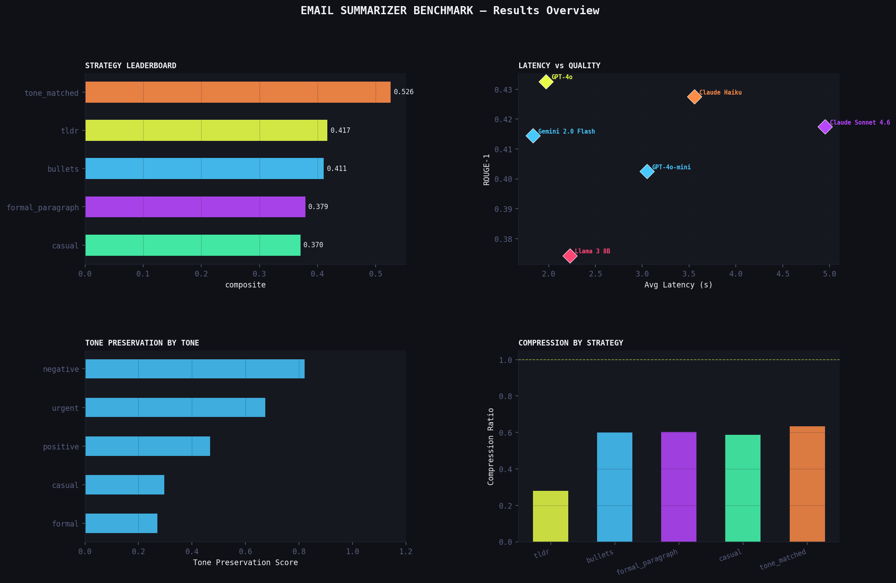

# 📧 P6 — AI Email Summarizer

> **Multi-strategy email summarization with tone detection, latency benchmarking, and a live Gradio demo**  
> Part of the [prompt-engineering-lab](../../README.md) portfolio

---

## Overview

Goes beyond "summarize this email" — systematically benchmarks 5 summarization strategies across 6 models, measures tone preservation, and ships a live interactive demo.

| | |
|---|---|
| **Strategies** | TL;DR · Bullet Points · Formal Paragraph · Casual · Tone-Matched |
| **Emails** | 20 emails: 15 single + 5 threads across 5 tone categories |
| **Models** | GPT-4o-mini · GPT-4o · Claude Haiku · Claude Sonnet 4.6 · Gemini 2.0 Flash · Llama 3 8B |
| **Metrics** | ROUGE-1/2/L · Tone preservation · Compression ratio · FK grade · Latency |
| **Demo** | Gradio web app — model picker, strategy selector, live output |

---

## Demo

```bash
pip install gradio
python app.py
# Opens at http://127.0.0.1:7860
```



---

## Results

### Model Leaderboard

| Rank | Model | Composite Score | Tone Preservation | Avg Latency |
|------|-------|----------------|-------------------|-------------|
| 1 | GPT-4o | 0.431 | 0.506 | 1.99s |
| 2 | Claude Haiku | 0.426 | 0.500 | 3.52s |
| 3 | GPT-4o-mini | 0.426 | 0.534 | 3.11s |
| 4 | Gemini 2.0 Flash | 0.420 | 0.499 | 1.90s |
| 5 | Claude Sonnet 4.6 | 0.414 | 0.487 | 5.06s |
| 6 | Llama 3 8B | 0.406 | 0.521 | 2.30s |

*Run `python update_findings.py` after the experiment to populate.*

### Strategy Comparison

| Strategy | Score | Avg Compression | Avg Word Count |
|----------|-------|----------------|----------------|
| tldr | 0.417 | 0.28x | 36 |
| bullets | 0.411 | 0.60x | 79 |
| formal_paragraph | 0.379 | 0.60x | 79 |
| casual | 0.370 | 0.59x | 77 |
| tone_matched | 0.526 | 0.63x | 83 |

---

## Project Structure

```
email-summarizer/
├── app.py               ← Gradio demo (python app.py → localhost:7860)
├── experiment.ipynb     ← Analysis notebook
├── run_experiment.py    ← Benchmark runner
├── evaluation.py        ← ROUGE + tone preservation + compression metrics
├── tone_detector.py     ← 5-class tone classifier (formal/casual/urgent/negative/positive)
├── visualize.py         ← 6 charts + hero image
├── update_findings.py   ← Auto-populate README + findings
├── prompts/
│   └── prompts.txt      ← 12 benchmark prompts + 5 tone-matched prompts
├── data/
│   └── emails.csv       ← 20 emails with reference summaries
└── results/
    ├── results.csv
    ├── leaderboard.csv
    ├── latency_report.csv   ← quality-per-second tradeoff
    └── charts.png
```

---

## Quick Start

```bash
pip install -r requirements.txt

export OPENAI_API_KEY="sk-..."
export ANTHROPIC_API_KEY="sk-ant-..."
export OPENROUTER_API_KEY="sk-or-..."

# Quick sanity check
python run_experiment.py --quick --models openai

# Full benchmark
python run_experiment.py

# Tone-matched prompts only
python run_experiment.py --tone-match

# Charts + README
python visualize.py
python update_findings.py

# Live demo
python app.py
```

---

## CLI Options

```
python run_experiment.py [options]

  --models      openai,anthropic,openrouter
  --strategies  tldr,bullets,formal_paragraph,casual
  --emails      E01,E05,E09
  --tone-match  run tone-matched prompts only
  --quick       5 emails, TLDR only
```

---

## Tone Detection

The `tone_detector.py` module classifies emails into 5 tone categories using signal lexicons:

| Tone | Signals |
|------|---------|
| `formal` | "pursuant", "please be advised", "dear", "sincerely" |
| `casual` | emoji, contractions, "lol", "omg", "hey" |
| `urgent` | "URGENT", "ASAP", "Severity 1", deadlines, time windows |
| `negative` | "unacceptable", "demand", "complaint", "refund", escalation words |
| `positive` | "congratulations", "thrilled", "approved", celebration language |

Tone detection feeds the **tone-matched** strategy, which automatically selects the best prompt for each email's register.

---

## Metrics Reference

| Metric | Description |
|--------|-------------|
| `rouge1` | Unigram F1 overlap with reference summary |
| `rouge2` | Bigram F1 overlap with reference summary |
| `rougeL` | Longest common subsequence F1 |
| `composite` | 0.3×ROUGE-1 + 0.3×ROUGE-L + 0.4×tone_preservation |
| `tone_preservation` | How well summary matches original email's tone (0–1) |
| `compression_ratio` | Summary length / email length |
| `quality_per_second` | ROUGE-1 / latency — efficiency metric |

---

## Related Projects

- **P1:** [Summarization Benchmark](../summarization-benchmark/) — evaluation patterns reused here
- **P4:** [Prompt Testing Framework](../prompt-testing-framework/) — `promptlab` can wrap this pipeline
- **P7:** [LLM Benchmark System](../prompt-benchmark-system/) — extends latency vs quality tradeoff analysis

---

*prompt-engineering-lab / projects / email-summarizer*
