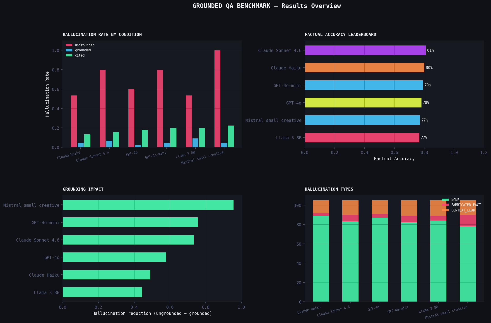

# 🔍 P5 — Grounded QA (Anti-Hallucination)

> **Measures how context grounding and citation enforcement reduce hallucination rates across models**  
> Part of the [prompt-engineering-lab](../../README.md) portfolio

---

## Overview

Hallucination is the #1 blocker to enterprise AI adoption. This project measures the problem quantitatively — testing how well different models hallucinate when answering questions with and without grounded context, including deliberate unanswerable traps.

| | |
|---|---|
| **Conditions** | Ungrounded (no context) · Grounded (context provided) · Cited (must quote source) |
| **Questions** | 15 benchmark questions across 5 domains — 5 are deliberately unanswerable |
| **RAG Pipeline** | TF-IDF retriever over 3 domain documents, no external APIs |
| **Models** | GPT-4o-mini · GPT-4o · Claude Haiku · Claude Sonnet 4.6 · Mistral small creative · Llama 3 8B |
| **Metrics** | Factual accuracy · Grounding rate · Hallucination type · Citation validity · Refusal rate |

---

## Results



### Model Leaderboard (Overall)

| Rank | Model | Factual Accuracy | Grounding Rate | Hallucination Rate | Latency |
|------|-------|-----------------|----------------|-------------------|---------|
| 1 | Claude Sonnet 4.6 | 81.0% | 79.0% | 21.0% | 3.45s |
| 2 | Claude Haiku | 80.0% | 84.8% | 15.2% | 1.81s |
| 3 | GPT-4o-mini | 79.0% | 78.1% | 21.9% | 2.03s |
| 4 | GPT-4o | 78.1% | 82.9% | 17.1% | 1.11s |
| 5 | Mistral small creative | 77.1% | 74.3% | 25.7% | 2.51s |
| 6 | Llama 3 8B | 76.7% | 80.0% | 20.0% | 1.64s |

*Run `python update_findings.py` after the experiment to populate.*

### Accuracy by Condition

| Condition | Avg Factual Accuracy | Avg Hallucination Rate |
|-----------|---------------------|------------------------|
| ungrounded | 27.2% | 71.1% |
| grounded | 92.8% | 5.2% |
| cited | 81.7% | 18.1% |

---

## Project Structure

```
grounded-qa/
├── experiment.ipynb         ← Main analysis notebook
├── run_experiment.py        ← CLI runner (benchmark + RAG modes)
├── evaluation.py            ← Hallucination scorer + citation validator
├── retriever.py             ← TF-IDF retriever (no external deps)
├── visualize.py             ← 6 charts + hero image
├── update_findings.py       ← Auto-populate README + findings
├── prompts/
│   └── prompts.txt          ← 7 prompts across 3 conditions
├── data/
│   ├── contexts.csv         ← 15 benchmark questions with ground truth
│   └── documents/           ← Raw docs for RAG pipeline
│       ├── climate_2023.txt
│       ├── eu_ai_act.txt
│       └── sodium_battery.txt
└── results/
    ├── results.csv
    ├── leaderboard.csv
    ├── hallucination_report.csv
    ├── rag_results.csv
    └── charts.png
```

---

## Quick Start

```bash
pip install -r requirements.txt

export OPENAI_API_KEY="sk-..."
export ANTHROPIC_API_KEY="sk-ant-..."
export OPENROUTER_API_KEY="sk-or-..."

# Quick test (6 questions, grounded only)
python run_experiment.py --quick --models openai

# Full benchmark
python run_experiment.py

# RAG pipeline demo
python run_experiment.py --mode rag

# Both
python run_experiment.py --mode both

# Charts + auto-fill README
python visualize.py
python update_findings.py
```

---

## CLI Options

```
python run_experiment.py [options]

  --mode        benchmark | rag | both  (default: benchmark)
  --models      openai,anthropic,openrouter
  --conditions  ungrounded,grounded,cited
  --questions   Q01,Q05,Q10
  --quick       6 questions, grounded only, fast
```

---

## Hallucination Taxonomy

| Type | Description |
|------|-------------|
| `NONE` | Fully grounded — no fabrications detected |
| `FABRICATED_FACT` | Invented number, name, or date not in context |
| `CONTEXT_LEAK` | Answered an unanswerable question using outside knowledge |
| `WRONG_SOURCE` | Correct fact but attributed to wrong entity |
| `PARTIAL` | Mostly correct but contains one unsupported claim |

---

## Metrics Reference

| Metric | Description |
|--------|-------------|
| `factual_accuracy` | Does output match ground truth? (0, 0.5, or 1.0) |
| `grounding_rate` | Does output stay within context? (0 or 1.0) |
| `hallucination_flag` | Binary: did any fabricated fact appear? |
| `hallucination_type` | Taxonomy label for the failure mode |
| `unanswerable_correct` | Did model correctly refuse when context lacks answer? |
| `citation_present` | Did model include a quoted passage? |
| `citation_valid` | Does the quoted passage actually exist in context? |

---

## Related Projects

- **P4:** [Prompt Testing Framework](../prompt-testing-framework/) — `promptlab` used for model calls
- **P8:** [Hallucination Detection System](../hallucination-detection/) — extends this into a full detection pipeline

---

*prompt-engineering-lab / projects / grounded-qa*
