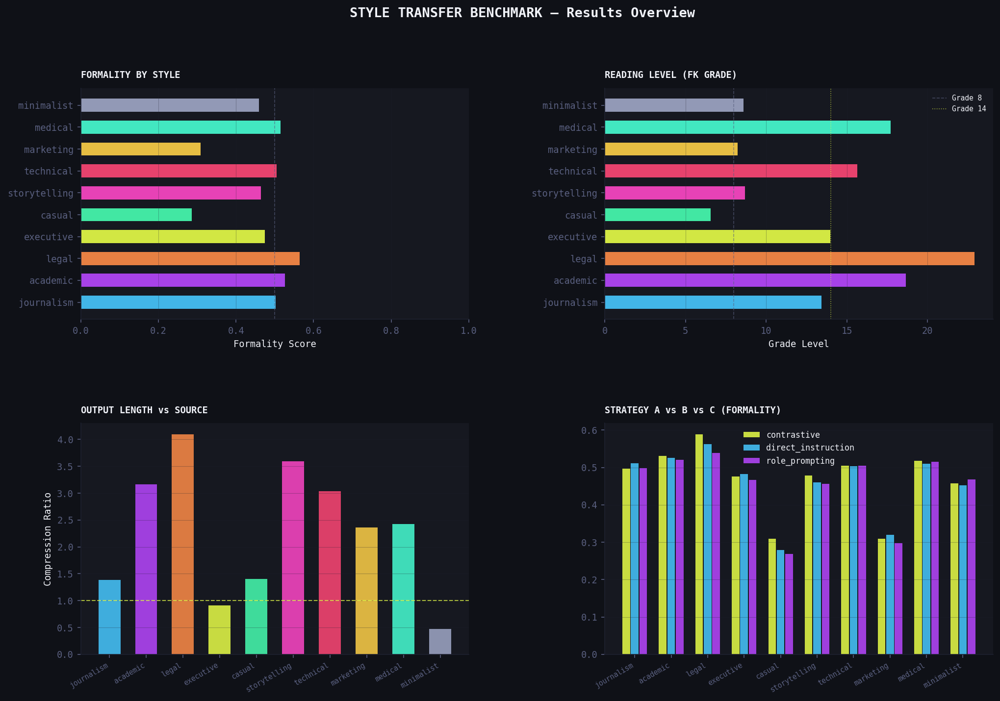

# ✍️ P2 — Style Transfer Prompts

> **Multi-style, multi-model writing style transfer benchmark with side-by-side gallery**  
> Part of the [prompt-engineering-lab](../../README.md) portfolio

-----

## Overview

Systematic evaluation of 10 writing style transfers across 3 prompt strategies and 6 LLMs.
Measures not just *whether* style transferred — but *how much*, using quantified metrics.

|              |                                                                                                                |
|--------------|----------------------------------------------------------------------------------------------------------------|
|**Styles**    |Journalism · Academic · Legal · Executive · Casual · Storytelling · Technical · Marketing · Medical · Minimalist|
|**Models**    |GPT-4o-mini · GPT-4o · Claude Haiku · Claude Sonnet 4.6 · Mistral Small Creative · Llama 3 8B                               |
|**Strategies**|A=Direct instruction · B=Role prompting · C=Contrastive DO/DON’T                                                |
|**Metrics**   |FK Grade · Formality Score · TTR · Sentiment Delta · Compression Ratio · LLM Judge                              |

-----

## Results



### Formality Shift by Style

| Style | Avg Formality | FK Grade | Compression | Winner Strategy |
|-------|--------------|----------|-------------|-----------------|
| legal | 0.563 | 22.9 | 4.10x | contrastive |
| academic | 0.526 | 18.6 | 3.16x | contrastive |
| medical | 0.515 | 17.7 | 2.42x | contrastive |
| technical | 0.504 | 15.6 | 3.04x | contrastive |
| journalism | 0.503 | 13.4 | 1.39x | direct_instruction |
| executive | 0.475 | 14.0 | 0.91x | direct_instruction |
| storytelling | 0.465 | 8.7 | 3.60x | contrastive |
| minimalist | 0.459 | 8.6 | 0.48x | role_prompting |
| marketing | 0.309 | 8.2 | 2.36x | direct_instruction |
| casual | 0.286 | 6.6 | 1.41x | contrastive |

*Run the experiment to populate. See `results/leaderboard.csv` for full data.*

-----

## Project Structure

```
style-transfer-prompts/
├── experiment.ipynb       ← Main analysis notebook
├── run_experiment.py      ← CLI runner
├── evaluation.py          ← Metrics engine (FK, formality, TTR, sentiment, compression)
├── visualize.py           ← 6 charts + hero image
├── gallery.py             ← Interactive HTML side-by-side gallery
├── prompts/
│   └── prompts.txt        ← 30 prompts: 10 styles × 3 strategies
├── data/
│   └── source_texts.csv   ← 5 source texts across 5 domains
└── results/
    ├── results.csv
    ├── leaderboard.csv
    ├── gallery.html        ← Open in browser for visual comparison
    ├── charts.png
    ├── chart_formality_heatmap.png
    ├── chart_fk_grade.png
    ├── chart_strategy_comparison.png
    ├── chart_delta_radar.png
    └── chart_compression.png
```

-----

## Quick Start

```bash
pip install -r requirements.txt

# Set API keys
export OPENAI_API_KEY="sk-..."
export ANTHROPIC_API_KEY="sk-ant-..."
export OPENROUTER_API_KEY="sk-or-..."

# Quick test
python run_experiment.py --quick --models openai

# Full run
python run_experiment.py

# Generate charts
python visualize.py

# Generate HTML gallery
python gallery.py
# → open results/gallery.html in browser

# Explore in notebook
jupyter notebook experiment.ipynb
```

-----

## CLI Options

```
python run_experiment.py [options]

  --models    openai,anthropic,openrouter
  --styles    journalism,legal,casual        Filter styles
  --texts     T01,T02                        Filter source texts
  --llm-judge                                Enable LLM style adherence scoring
  --quick                                    Fast subset (2 texts, 3 styles, strategy A)
```

-----

## Metrics Reference

|Metric                |Description                                                      |
|----------------------|-----------------------------------------------------------------|
|**FK Grade**          |Flesch-Kincaid grade level — higher = more complex reading       |
|**Formality Score**   |0–1 proxy score based on formal/informal word markers            |
|**TTR**               |Type-Token Ratio — lexical diversity (unique words / total words)|
|**Sentiment Polarity**|-1 (negative) to +1 (positive), using lexicon-based scoring      |
|**Compression Ratio** |Output word count / source word count (1.0 = same length)        |
|**Delta FK**          |FK grade shift from source to output                             |
|**Delta Formality**   |Formality change from source to output                           |
|**Judge Score**       |LLM-evaluated style adherence (1–5, requires `--llm-judge`)      |

-----

## Prompt Strategies

Each of the 10 styles has 3 prompt variants:

|Strategy           |Description                                   |Example Signal                                   |
|-------------------|----------------------------------------------|-------------------------------------------------|
|**A — Direct**     |Explicit instructions about format and tone   |“Write in the style of a news article…”          |
|**B — Role**       |Assign an expert persona with audience context|“You are a senior attorney writing for judges…”  |
|**C — Contrastive**|Explicit DO/DON’T rules                       |“DO: use passive voice. DON’T: use contractions.”|

-----

## Gallery

The HTML gallery (`results/gallery.html`) lets you:

- Browse all 10 styles per source text
- Switch between models to compare outputs
- View metric badges (FK grade, formality, latency) per output

-----

## Related Projects

- **P1:** [Summarization Benchmark](../summarization-benchmark/) — eval infrastructure used here
- **P6:** [Prompt Testing Framework](../prompt-testing-framework/) — automates strategy A/B/C testing
- **P7:** [LLM Benchmark System](../prompt-benchmark-system/) — extends to full multi-task dashboard

-----

*prompt-engineering-lab / projects / style-transfer-prompts*
